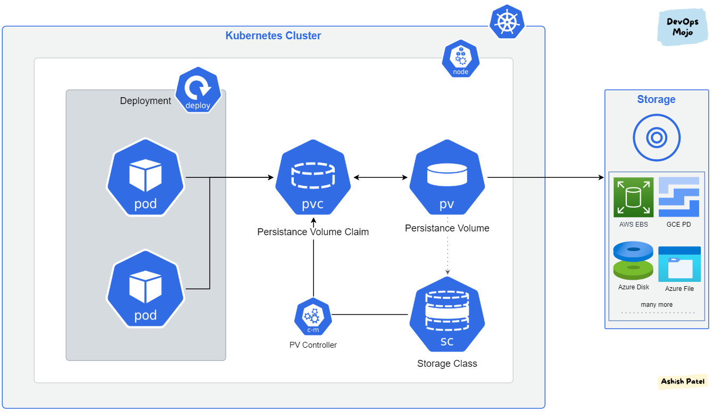
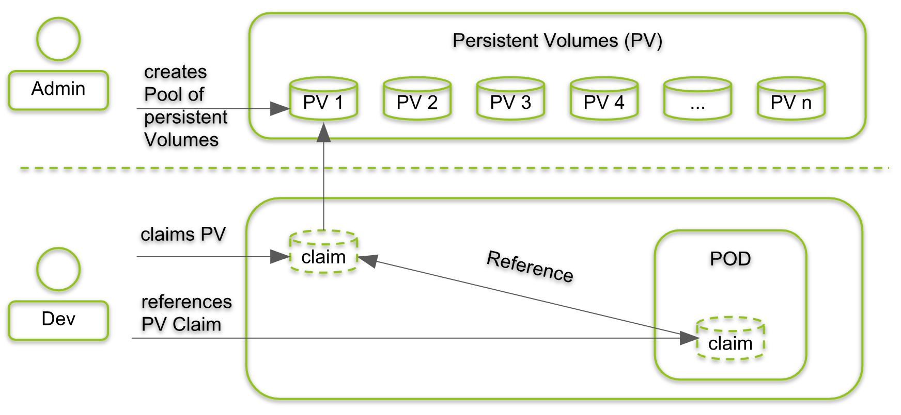

# Kubernetes - Udemy

## Introdução

- Aula 1: Infraestrutura, Cloud, Microsserviços, Docker e Cluster
    - Explicação sobre o modelo cliente-servidor.
    - Explicação sobre infraestutura
    - Explicação sobre Cloud
    - Explicação sobre virtualização
    - Explicação sobre microsserviços
    - Explicação sobre container
    - Explicação sobre docker
    - Diferença entre virtualização e container
    - Explicação sobre cluster

- Aula 2: O que é Kubernetes
    - Explicação sobre Kubernetes

## Laboratório local de estudos

- Aula 3: Instalando o minikube
    - Explicando sobre o minikube, ferramenta utilizada para usar o kubernetes na máquina local, não recomendado para utilização em ambiente de produção.
    - Site instalação do minikube <https://minikube.sigs.k8s.io/docs/start/>

    ```minikube start --driver=docker```

- Aula 4: Instalando o Docker Desktop

- Aula 5: Instalando o minikube utilizando o virtual box para S.Os mais antigos

- Aula 6: Instalando o Docker, Minikube e kubectl no Linux

## Cluster Kubernetes em Produção (AWS/GCP)

- Aula 7: Arquitetura básica do cluster Kubernetes
    - Componentes do Kubernetes
        - Ao implantar o Kubernetes você obtém um cluster.
        Um cluster Kubernetes consiste em um conjunto de servidores de processamento, chamados nós, que executam aplicações em conteineres. Todo o cluster possui ao menos um servidor de processamento (Worker Node) e um servidor de gerenciamento (Master Node)
        - O que é um cluster Kubernetes?
        Um Kubernetes cluster é um conjunto de nós que executam aplicativos em conteineres
        Kubernetes cluster é um conjunto de máquinas usadas para executar aplicações em conteineres. Quando você executa o Kubernetes, está executando um cluster.
        No mínimo, um cluster contém um plano de controle (Master Node) e pelo menos uma máquina ou nó (Worker Node)
        - O servidor de processamento (Worker) hospeda os Pods que são componentes de uma aplicação. O ambiente de gerenciamento gerencia os nós de processamento e os Pods no Cluster. Em ambientes de produção, o ambiente de gerenciamento é geralmente executado em múltiplos computadores, provendo tolerância a falhas e alta disponibilidade.
    - Componentes da camada de gerenciamento
        - Os componetes da camada de gerenciamento tomam decisões globais sobre o cluster, bem como detectam e respondem aos eventos do cluster.
        Os componentes da camada de gerenciamento podem ser executados em qualquer máquina do cluster. Contudo, para simplificar, os scripts de configuração normalmente iniciam todos os componentes da camada de gerenciamento na mesma máquina.
            - kube-apiserver
            O servidor de API do kubernetes valida e configura dados para os objetos presentes no cluster, que incluem Pods, serviços, controladores de replicação e outros. O API Server atende as operações e fornece o frontend para o estado compartilhado do cluster por meio do qual todos os outros componentes interagem.
            - etcd
            etcd é um armazenamento de valor em cluster. Ele ajuda a viabilizar atualizações automáticas mais seguras, coordena a programação de trabalhos em hosts e ajuda a configurar redes de sobreposição para containers.
            etcd é um componente importante de vários outros projetos. Ele se destaca por ser o armazenamento de dados principal do Kubernetes.
            - kube-scheduler
            kube-scheduler é um processo que atribui Pods a nós. Ele determina quais nós são os posicionamentos válidos para cada Pod na fila de agendamento de acordo com as restrições e os recursos disponíveis. O kube-scheduler então classifica cada Node válido e vincula o Pod a um Node adequado.
            - kube-controller-manager
            No Kubernetes, um controlador é um loop que observa o estado compartilhado do cluster por meio do kube-apiserver e faz alterações tentando mover o estado atual para o estado desejado.
        - Administração da camada de gerenciamento
            - kubeadm: O comando para criar o cluster.
            - kubelet: O componente que executa em todas as máquinas no seu cluster e cuida de tarefas como a inicialização de Pods e contêineres.
            - kubectl: A ferramenta de linha de comando para interação com o cluster.
        - Amazon EKS
        O Amazon Elastic Kubernetes Service é um serviço gerenciado de Kubernetes que descarta a necessidade de instalar e operar a camada de gerenciamento do cluster. Ele é certificado como compatível com o Kubernetes, portanto, você pode migrar qualquer aplicativo com facilidade para o EKS.

- Aula 8: Custos de um Cluster Kubernetes em nuvem (AWS)
    - Mostrando uma estimativa de custos na AWS

- Aula 9: AWS CLI e credenciais de acesso
    - Configurando a AWS CLI e credenciais de acesso
    - Site com a AWS CLI <https://aws.amazon.com/pt/cli/>
    - Configurando Access Key na AWS para conexão com o AWS CLI
    
    ```aws configure```

- Aula 10: Criando um cluster em nuvem utilizando o AKS
    - Verificando o status de criação do Cluster via AWS CLI
    
    ```aws eks --region sa-east-1 describe-cluster --name kubernetes-lab --query cluster.status```
    
    - Atualizar o arquivo de configuração local para que funcione o kubectl no cluster da nuvem (atualizando o arquivo .config dentro do seu user/.kube)
    
    ```aws eks --region sa-east-1 update-kubeconfig --name kubernetes-lab```

- Aula 11: Adicionando Nodes ao Cluster
    - Criando Nodes dentro do Cluster no EKS
    - Necessário criar role de permissão
    
    ```kubectl get nodes --watch```

- Aula 12: Criando um cluster em nuvem utilizando GCP
    - Acessando a plataforma do GCP pela primeira vez é necessário instalar o Google Cloud CLI <https://cloud.google.com/sdk/docs/install?hl=pt-br>
    - Instalação de algumas features necessárias
    
    ```Install-Module GoogleCloud```
    
    ```Set-ExecutionPolicy RemoteSigned```
    
    ```gcloud components install gke-gcloud-auth-plugin```
    
    ```gcloud auth plugin```
    
    ```gcloud auth list```
    
    - Ir no projeto, depois no cluster e clicar em conectar ao cluster o mesmo dará a linha de comando necessária para conexão com o cluster.
    
    ```gcloud container clusters get-credentials MEU-CLUSTER --region REGION --project ID-PROJECT```

## Primeiros passos com Kubernetes

- Aula 13: Implementando um aplicativo
    - O que é um POD
    Um POD do Kubernetes é um conjunto de um ou mais conteineres, sendo a menor unidade de uma aplicação Kubernetes. Os PODs são compostos por um conteiner nos casos de uso mais comuns ou por vários conteineres fortemente acoplados em cenários mais avançados. Os conteineres são agrupados nesses PODs para que os recursos sejam compartilhados de modo mais inteligente.
    - O que é YAML (YML)?
    O YAML é uma linguagem de serialização de dados muito usada na escrita de arquivos de configuração.
    O YAML usa um recuo no estilo Python para indicar o aninhamento. É necessário utilizar espaços em branco porque os caracteres de tabulação não são permitidos. Não há símbolos de formato comuns, como chaves, colchetes, tags de fechamento ou aspas. Os arquivos YAML têm a extensão .yml ou .yaml.
    - Criando o primeiro POD, criação do arquivo pod.yaml
    
    ```kubectl apply -f .\Code\pod.yaml```
    
    ```kubectl get pod```

Aula 14: Outro exemplo de criação de um POD.
- Mostrando informações adicionais de um POD
    
    ```kubectl get pod```
    
    ```kubectl get pod -o wide```

- Testando APP pelo minikube 
    
    ```minikube ssh```
    
    ```curl IP-DO-POD```
    
- Apagando POD
    
    ```kubectl delete pod myapp-html```

Aula 15: Criando um arquivo YAML de Deployment
- Criando o primeiro arquivo de deployment.
    - Alterando a quantidade de replicas.
    - Deletando um POD ele recria automaticamente devido a configuração do Deployment

Aula 16: Mais informações sobre um Deployment
- Aumentando o numero de POD (replicas) via CLI sem precisar alterar o arquivo de Deployment
    
    ```kubectl scale deployment app-html-deployment --replicas=10```

Aula 17: Expondo um Deployment
- Comando para exposição do Deployment via CLI
    
    ```kubectl expose deployment app-html-deployment --type=LoadBalancer --name=app-html --port=80```

- Verificando exposição
    
    ```kubectl get service```

- Expondo service do minikube (O terminal precisa estar aberto)
    
    ```minikube service --url app-html```

## Seção Docker + Kubernetes    

Aula 18: Criando uma imagem personalizada
- Criando o diretório Dockerfile, com arquivo dockerfile e um arquivo html
- Criando uma imagem do Docker
    
    ```docker build . -t USUARIO/app-html:1.0```

- Enviando a imagem para o DockerHub
    
    ```docker login```
    
    ```docker push USUARIO/app-html:1.0```

Aula 19: Criando um Deployment de um aplicativo
- Criando um Deployment usando a imagem do DockerHub criada anteriormente
    
    ```kubectl apply -f .\App1.0\Kubernetes\app-deployment.yaml```
    
    ```kubectl expose deploy html-deployment --type=LoadBalancer --name=app-html```
    
    ```minikube service --url app-html```

Aula 20: Atualizando um aplicativo
- Criando outro diretório App1.1 alterando o arquivo index.html e fazendo um build da nova imagem
    
    ```docker build . -t USUARIO/app-html:1.1```
    
    ```docker push USUARIO/app-html:1.1```

- Aplicando novo Deployment da versão 1.1 do app
    
    ```kubectl apply -f .\App1.1\Kubernetes\app-deployment.yaml```
    
    ```minikube service --url app-html```

Aula 21: Criando um Load Balancer por YAML
- Criando o arquivo YMAL para a exposição do serviço
    
    ```kubectl apply -f .\App1.1\Kubernetes\app-html-lb.yaml```
    
    ```minikube service --url app-html-lb```

## Cluster Kubernetes em produção

Aula 22: Criando um NodePort
- Criando novo diretório App2.0 para criação de NodePort
- Criando um POD com uma imagem docker que subimos com PHP
- Acessando o serviço do App pelo Node
    
    ```kubectl get node -o wide```

- Executando o yaml do nodePort
    
    ```kubectl apply -f .\Kubernetes\nodePort.yaml```
    
    ```kubectl get svc```
    
    ```kubectl describe svc myapp-php-service```

Aula 23: NodePort com o MiniKube
- Expondo o serviço do Minikube
    
    ```minikube service --url myapp-php-service```

Aula 24: Executando aplicações no POD
- Executando um container no POD
    
    ```kubectl exec --stdin --tty myapp-php -- /bin/bash```
    
    ou
    
    ```kubectl exec -it myapp-php -- /bin/bash```

- Alterado o arquivo index.php executando o container

Aula 25: Deployment e Service em um único arquivo YAML
- Criando o diretório App3.0, unindo o manifestos de POD e Service, separados por 
    
    ```---```

Aula 26: Encaminhamento de porta
- Criando um diretório App4, adicionando um POD Mysql.
    
    ```kubectl port-forward pod/mysql-pod 3306:3306```

Aula 27: Criando conexão com um banco de dados
- Criando um diretório App5 e feito clone do repositório de exemplo do instrutor.
- Realizado o build da imagem e enviado para o dockerhub de um banco de dados mysql.
    
    ```kubectl apply -f .\database\db-deployment.yml```
    
    ```minikube service --url myapp-php-service```

- Alterando o arquivo js.js do diretório frontend informando o ip e porta entregues pelo minikube
- Gravando dados pelo frontend acessando o index <file:///C:/Cursos/UDEMY/Udemy-Kubernetes/Code/App5/frontend/index.html>
- Validando dados salvos, acessando o POD de banco de dados
    
    ```kubectl exec --stdin --tty mysql-7b967c9c4f-8dcj4 -- /bin/bash```

Aula 28: Introdução ao PV e PVC
- Persistência de dados
    O gerenciamento de armazenamento é uma questão bem diferente do gerenciamento de instâncias computacionais. O subsistema PersistenVolume provê uma API para usuários e administradores que mostra de forma detalhada de como o armazenamento é provido e como ele é contruído. Para isso, o Kubernetes possui duas novas APIs: **PersistentVolume** e **PersistentVolumeClaim**.
- PersistVolume (PV)
    PVs são plugins de volume, porém eles têm um ciclo de vida independente de qualquer POD que utilize um PV. Essa API tem por objetivo mostrar os detalhes da implementação do armazenamento, seja ele NFS, iSCSI, ou um armazenamento específico de um provedor de cloud pública.
- PersistentVolumeClaim (PVC)
    O PVC é uma requisição para armazenamento por um usuário. Claims podem solicitar ao PV tamanho e modos de acesso especificos. Uma reinvidicação de volume persistente (PVC) é a solicitação de armazenamento, que é atendida vinculando a PVC a um volume persistente (PV).



Aula 29: Criando os arquivos de configuração do PV e PVC
- Criado um diretório no mesmo repo com um nome de App6, porém inseri o mesmo no .gitignore para não realizar o push.
- Criado arquivo YAML com a configuração do volume local que será usado pelo POD do mysql.
    
    ```kubectl describe po NOMEDOPOD```

    ```
    Volumes:
    local:
        Type:          HostPath (bare host directory volume)
        Path:          /meubanco/
    ```

Aula 30: PV local (Mais detalhes)
- Criando um PV, foi criado o arquivo YAML chamado pv.yaml

    ```kubectl apply -f .\pv.yaml```

- Criando o PVC, foi criado o arquivo YAML chamado pvc.yaml

Aula 31: Atribuindo um PVC
- Comandos:    
    ```kubectl apply -f .\pvc.yaml```

    ```kubectl get pvc```

    ```kubectl get pv```

- Editando o arquivo YAML mysql-local para usar o PVC

    ```kubectl apply -f .\mysql-local.yaml```

Aula 32: Armazenamento persistente em nuvem
- Documentação sobre PV e PVC no GCP <https://cloud.google.com/kubernetes-engine/docs/concepts/persistent-volumes?hl=pt-br>
- O GCP cria automaticamente o PV, é necessário criar somente o PVC e vincular ao POD/DEPLOY.

Aula 33: Utilizando um servidor NFS (Cloud Filestore)
- Criado um arquivo YAML de deploy httpd-nfs com comentários de como criar um PV no GCP utilizando o filestore.
- Mostrando a utilização do ReadWriteMany com a criação de um NFS para que os PODs independente do Cluster possam ler e gravar dados no PV.

Aula 34: Histórico de Deployment
- Criando um diretório App7 com um arquivo YAML de deploy.
    
    ```kubectl apply -f .\Kubernetes\deploy.yaml```

- Mostrando histórico de Deployment

    ```kubectl rollout history deploy httpd```

- Ativando o histórico de Deployment, aplicando o deploy com a flag *--record*

    ```kubectl apply -f .\Kubernetes\deploy.yaml --record```

    ```kubectl rollout history deploy httpd```

    ```
    deployment.apps/httpd
    REVISION  CHANGE-CAUSE
    1         kubectl.exe apply --filename=.\Kubernetes\deploy.yaml --record=true
    ```

- Atualizando o arquivo de deploy
- Voltando um deploy anterior

    ```kubectl rollout undo deploy httpd```

- Verificando Deplyment

    ```kubectl describe deploy httpd```

- Verificando versões do Deplyment

    ```kubectl rollout history deploy httpd```

    ```
    REVISION  CHANGE-CAUSE
    1         kubectl.exe apply --filename=.\Kubernetes\deploy.yaml --record=true
    3         kubectl.exe apply --filename=.\Kubernetes\deploy.yaml --record=true
    4         kubectl.exe apply --filename=.\Kubernetes\deploy.yaml --record=true
    ```

- O comando ```kubectl rollout undo deploy``` volta para a última versão do deploy sempre, para escolher uma versão você pode usar a flag *--to-revision=1* (1 igual número da versão que você deseja)

```kubectl rollout undo deploy httpd --to-revision=1```

Aula 35: Organizando o histórico de Deployment
- Criando um diretório App8 com um arquivo de Deployment nomeado corretamente para mostrar o histórico e poder assim escolher a melhor opção para um possível rollback.

    ```kubectl rollout history deploy app-html```

    ```
    REVISION  CHANGE-CAUSE
    1         kubectl.exe apply --filename=.\Kubernetes\app-html1-0.yaml --record=true
    ```

- Criado um novo Deployment com uma nomenclatura que mostre a versão da sua app para ter um melhor controle das versões.

    ```kubectl apply -f .\Kubernetes\app-html1-0.yaml --record```

    ```kubectl rollout history deploy app-html```

    ```
    REVISION  CHANGE-CAUSE
    1         kubectl.exe apply --filename=.\Kubernetes\app-html1-0.yaml --record=true
    2         kubectl.exe apply --filename=.\Kubernetes\app-html1-1.yaml --record=true
    ```

Aula 36: Secrets
- Um Secret é um objeto que contém uma pequena quantidade de informação sensível, como senhas, tokens ou chaves. Este tipo de informação poderia, em outras circustâncias, ser colocada diretamente em uma configuração de POD ou em uma imagem de contêiner. O uso de Secrets evita que você tenha de incluir dados confidenciais no seu código.
- Secrets podem ser criados de forma independente dos PODs que os consomem. Isto reduz o risco de que o Secret e seus dados sejam expostos durante o processo de criação, visualização e edição ou atualização de PODs.
- Criado diretório App9 com arquivo YAML do tipo Secret.
    
    ```kubectl apply -f .\Kubernetes\secrets.yaml```

    ```kubectl get secrets```

- Subindo deploy de um mysql utilizando as secrets.

    ```kubectl apply -f .\Kubernetes\mysql.yaml```

    ```kubectl describe po NOMEDOPOD```

    ```
    Environment:
      MYSQL_ROOT_PASSWORD:  <set to the key 'ROOT_PASSWORD' in secret 'my-secret'>   Optional: false
      MYSQL_DATABASE:       <set to the key 'MYSQL_DATABASE' in secret 'my-secret'>  Optional: false
    ```

## Projeto CI/CD com Gitlab

Aula 37: O que é CI/CD?
- O que é um Deploy?
    - A implantação (Deploy) envolve mover o software de um ambiente controlado para outro. Um ambiente é um subconjunto de infraestrutura de TI usado para uma finalidade específica.
- Integração Contínua (CI)
    - A integração contínua é uma prática de desenvolvimento de software em que os desenvolvedores, com frequência, juntam suas alterações de código em um repositório central. Depois disso, criações e testes são executados. Os principais objetivos da integração contínua são encontrar e investigar erros rapidamente, melhorar a qualidade do software e reduzir o tempo necessário para validar e lançar novas atualizações de software.
- Entrega Contínua (CD)
    - A entrega contínua é uma prática de desenvolvimento de software em que alterações de código são criadas, testadas e preparadas automaticamente para liberação para produção. Ela expande com base na integração contínua, pela implantação de todas as alterações de código em um ambiente de teste e/ou ambiente de produção, após o estágio de criação. Quando a integração contínua for implementada adequadamente, os desenvolvedores sempre terão um artefato de criação pronto para ser implantado, e que passou por um processo de teste padronizado.
- Criação do diretório inicial para o projeto de CI & CD.

Aula 38: Criando uma pipeline de criação de imagens
- A Aula foi explicada como criar a pipeline de ci-cd por GitLab, eu criei o diretório chamado CI-CD e usei o GitHub para a criação da pipe no diretório ```.github\workflows\ci.yaml```
    - Necessário gerar um Token no DockerHub para realizar a conexão via github actions.
    - na parte de build-push criei o context que é o local padrão onde está alocado o dockerfile para gerar a imagem e enviar para o dockerhub.
    - Editei também o tag, criando a tag latest.
    - OBSERVAÇÃO: Pesquisar para gerar novas tags e não substituir a latest.

Aula 39: Criando uma MV do tipo Bastion para a gerencia do Cluster
- Marcado vídeo como lido no qual ele explica como criar uma maquina bastion, meus testes estão locais.

Aula 40: Criando um pipeline de Deplyment no cluster Kubernetes
- 
